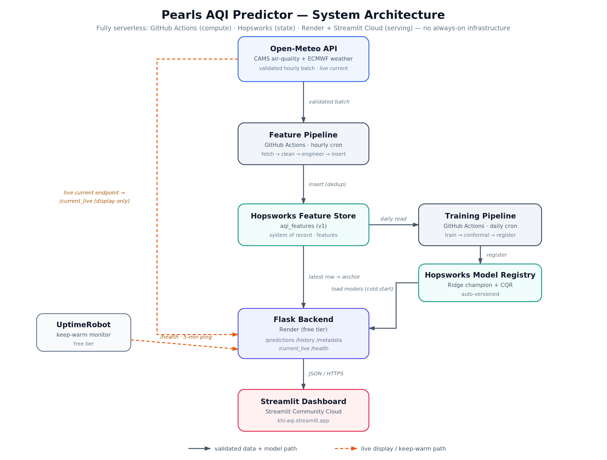
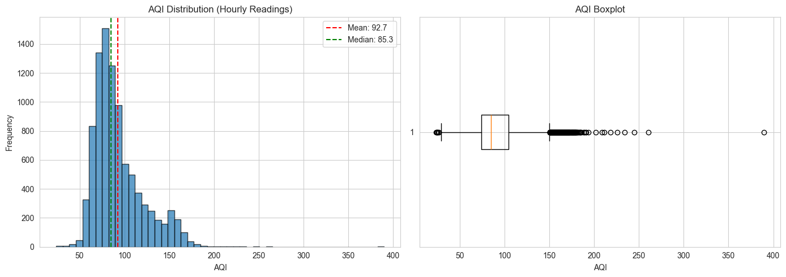
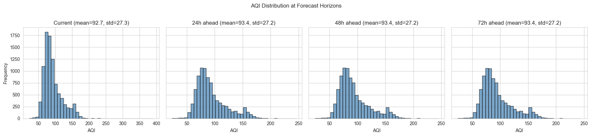
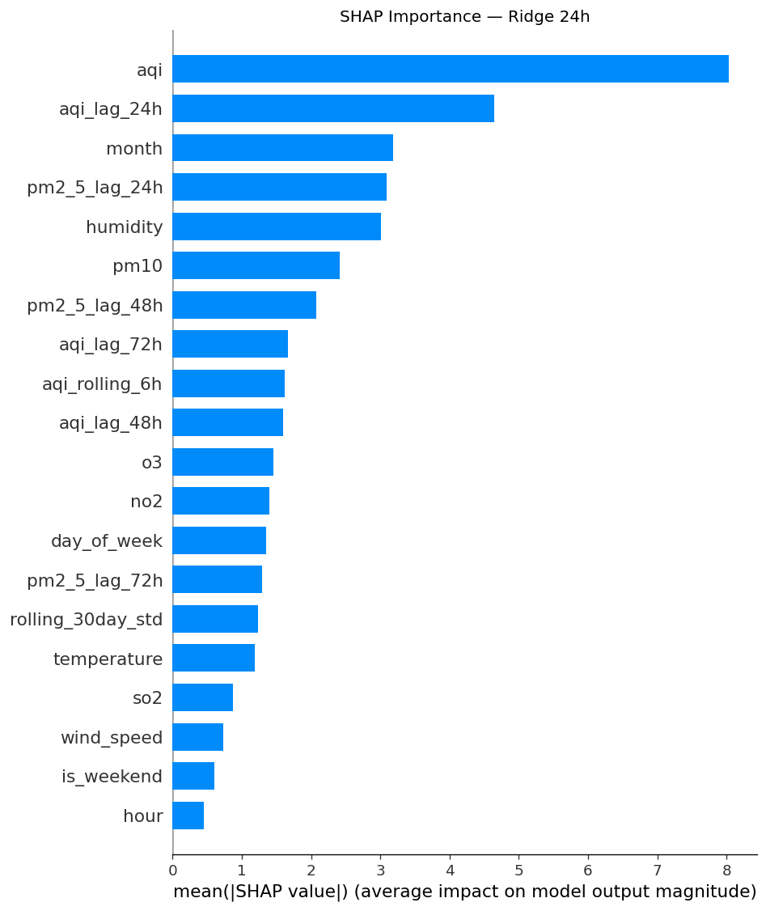
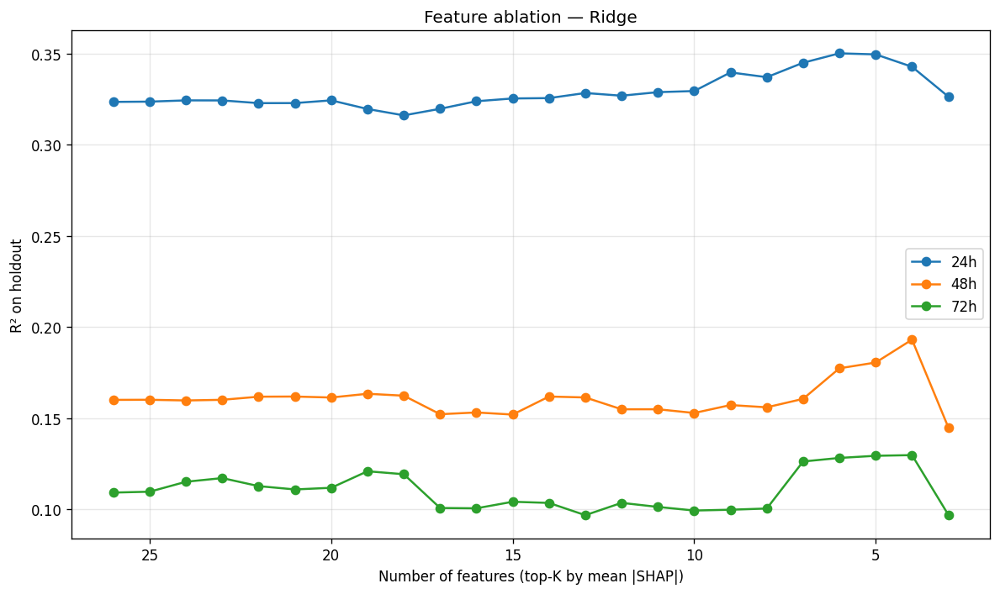
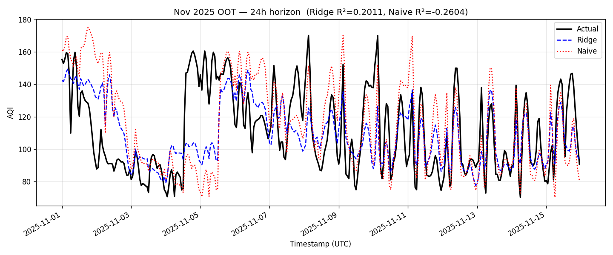

# Pearls AQI Predictor — Final Report

**Author:** Rameen Zehra
**Tag:** v1.0-submission
**Date:** June 2026

**Live dashboard:** [khi-aqi.streamlit.app](https://khi-aqi.streamlit.app)
**Prediction API:** [pearls-aqi-backend.onrender.com](https://pearls-aqi-backend.onrender.com)
**Repository:** [github.com/rameenzehraa/pearls_aqi_predictor](https://github.com/rameenzehraa/pearls_aqi_predictor)

---

## Table of Contents

1. [Executive Summary](#1-executive-summary)
2. [Problem Statement](#2-problem-statement)
3. [System Architecture and Automation](#3-system-architecture-and-automation)
4. [Data Sources](#4-data-sources)
5. [Exploratory Data Analysis](#5-exploratory-data-analysis)
6. [Feature Engineering and Pipeline](#6-feature-engineering-and-pipeline)
7. [Model Training and Selection](#7-model-training-and-selection)
8. [Conformal Prediction Intervals](#8-conformal-prediction-intervals)
9. [Serving Layer: API and Dashboard](#9-serving-layer-api-and-dashboard)
10. [Out-of-Time Verification](#10-out-of-time-verification)
11. [Operational Observations](#11-operational-observations)
12. [Future Work](#12-future-work)
13. [Conclusion](#13-conclusion)

**Appendices**
- [A — Glossary](#appendix-a--glossary)
- [B — References](#appendix-b--references)

---

## 1. Executive Summary

Pearls AQI Predictor is a publicly accessible system that forecasts Karachi's Air Quality Index at three horizons — 24, 48, and 72 hours ahead — alongside a live current-conditions reading. Data is ingested hourly from a public meteorological API, models are retrained daily, and the dashboard updates on every page load. No manual intervention is required.

### 1.1 Architecture at a glance

| Layer | Service |
|---|---|
| Data source | Open-Meteo (air quality + weather) |
| Feature store & model registry | Hopsworks |
| Scheduled compute | GitHub Actions (hourly ingestion, daily training) |
| Prediction API | Flask on Render |
| Dashboard | Streamlit Community Cloud |

The production model is a Ridge regression on five features, selected through systematic comparison against tree-based and recurrent-neural alternatives.

### 1.2 Headline outcomes

On the chronological hold-out (final 20% of the time-ordered dataset, n ≈ 1,750):

| Horizon | R² | RMSE | MAE |
|---|---|---|---|
| 24h | 0.350 | 20.15 | 15.05 |
| 48h | 0.181 | 22.64 | 16.76 |
| 72h | 0.129 | 23.35 | 17.50 |

The R² decay across horizons (0.35 → 0.18 → 0.13) closely matches the underlying autocorrelation decay in Karachi's AQI signal (0.63 → 0.49 → 0.41), indicating the model is operating at the ceiling set by the data rather than under-fitting.

On a high-variance stress test — a 15-day simulation across November 2025's seasonal pollution peak — the model beats a naive "tomorrow equals today" baseline by **20–24% on RMSE at every horizon**.

Every point forecast comes with an 80%-target conformal prediction interval. Empirical hold-out coverage is 86.4% / 82.9% / 86.8% across horizons — slightly conservative, which is the appropriate direction to err for a public-health-relevant tool.

### 1.3 Honest limitations

Two limitations stem from running on free-tier infrastructure. The Hopsworks offline materialisation stalled for nine days in late May because the shared free-tier compute cluster was capacity-saturated; the diagnostic and recovery work is documented in Section 11. The Streamlit dashboard and Render backend both sleep after inactivity, producing a one-time ~30-second wake-up delay — accepted as a cosmetic cost of zero infrastructure spend.

---

## 2. Problem Statement

Karachi consistently ranks among the most polluted major cities in the world. Pakistan's average PM2.5 in 2025 was 67.3 µg/m³ — an AQI of around 156 ("unhealthy"), nearly 14 times the WHO guideline. For residents — particularly children, the elderly, and people with respiratory conditions — air quality is a daily decision input. **Real-time AQI tells you "what is the air like now." It doesn't tell you "what will it be like tomorrow"** — which is the question that actually shapes behaviour.

Pakistan has reasonable real-time monitoring but lacks publicly accessible, multi-day AQI forecasting at the city level. Closing that gap — one city, three horizons, with honest uncertainty — has concrete utility for outdoor planning, sensitive-group health management, and indoor preparation.

### 2.1 What the system predicts (and doesn't)

The system predicts **one AQI value per forecast horizon, anchored to the present moment**. It does *not* produce an hourly trajectory through the next 72 hours. At any inference time *t*: a point prediction at *t + 24h*, at *t + 48h*, and at *t + 72h*, each with a conformal interval. Three predictions total per call. The dashboard's trajectory chart connects these as four points; the connecting line is interpolation for visual continuity, not a prediction at intermediate hours.

**Out of scope:** no pollution-source attribution; no per-pollutant forecasts (AQI is a composite); no sub-city resolution (CAMS data doesn't support it — Section 4.2); no multi-city expansion.

---

## 3. System Architecture and Automation

The system is fully serverless and end-to-end automated. Data flows one direction: Open-Meteo → feature store → daily training → model registry → Flask backend → Streamlit dashboard. No component runs on infrastructure the project operates or pays for.

**Figure 3.1.** System architecture. Solid arrows trace the validated-data and model-production path; dashed arrows trace the live-display and keep-warm paths.

### 3.1 Components

| Component | Role | Hosted on |
|---|---|---|
| Open-Meteo API | CAMS air quality + ECMWF weather | Third-party |
| Feature pipeline | Hourly ingest | GitHub Actions cron |
| Training pipeline | Daily retrain + registration | GitHub Actions cron |
| Hopsworks Feature Store | System of record for features | Hopsworks (free) |
| Hopsworks Model Registry | Versioned champion + CQR artifacts | Hopsworks (free) |
| Flask backend | Prediction REST API | Render (free) |
| Streamlit dashboard | Public end-user UI | Streamlit Community Cloud |
| UptimeRobot | Health pings to suppress cold starts | Third-party (free) |

Durable state lives only in Hopsworks. The backend and dashboard hold no persistent state — either can be restarted with no data loss.

### 3.2 Three independent flows

- **Ingest (hourly).** GitHub Actions cron triggers the feature pipeline. CAMS publishes once daily (Section 4.4), so most hourly runs find no new data and exit cleanly — the hourly schedule is a resilience layer.
- **Train (daily).** A second cron triggers the training pipeline, which fits one Ridge champion per horizon (Section 7) and CQR intervals (Section 8), then registers all six artifacts.
- **Serve (on demand).** When a user opens the dashboard, Streamlit calls the Flask backend. On cold start the backend loads the latest models from the registry and caches them to disk. `/predictions` reads the most recent validated row as the anchor and computes the three forecasts.

### 3.3 The dual-endpoint design

The architecture reads from two Open-Meteo endpoints. The validated hourly batch is the system of record — it feeds the feature store, training, and forecast anchor. The live `current` endpoint feeds only the display tile, giving a sub-15-minute "now" reading without contaminating the forecast path. Full rationale in Section 4.3.

### 3.4 CI/CD

Two GitHub Actions workflows: feature pipeline (`5 * * * *`, 10-min timeout) and training pipeline (`0 2 * * *`, 30-min timeout). Each declares a concurrency group with `cancel-in-progress: false` to block overlapping runs. The training workflow runs `pytest tests/` *before* training — a failing test aborts before any model is registered. Credentials come from GitHub Actions secrets. Failure surfaces as a red Actions run with the standard notification.

---

## 4. Data Sources

### 4.1 Open-Meteo

The sole external data source — free, no-auth public APIs. Two endpoints: **air quality** (PM2.5, PM10, NO₂, O₃, SO₂, CO, backed by CAMS) and **weather** (temperature, humidity, wind, pressure, backed by ECMWF). Both queried for the Karachi centroid (**24.8607°N, 67.0011°E**) and merged on UTC timestamp.

### 4.2 Single coordinate, not a city grid

An initial design considered 31 coordinates for Karachi's administrative subdivisions. A diagnostic showed those 31 resolved to **11 nominal CAMS grid cells**, of which only **~3 produced meaningfully distinct signals** — mean off-diagonal correlation exceeded 0.97. Producing 31 separate forecasts from data supporting ~3 distinct signals would be presentation theatre. Scope was refined to a single city-wide forecast.

### 4.3 The dual-endpoint architecture

- **Validated hourly endpoint (training + forecast anchor).** Open-Meteo's `forecast` API with `past_days=1` returns CAMS-validated hourly data. The training pipeline and live inference both read from the feature group built on this data. Using validated data ensures training and serving see the same distribution.
- **`current` endpoint (live tile only).** Returns the most recent reading with ~15 minute lag (vs. the validated endpoint's 6–24 hours), but less rigorously processed. The dashboard's "Current Conditions" tile pulls from this for display only.

Mixing them would risk a training/serving distribution mismatch. Keeping them separate preserves both prediction integrity and live freshness.

### 4.4 CAMS publishing cadence

CAMS publishes the previous day's 24 hours in a single batch around 00:00 UTC. So of the 24 hourly cron runs per day, only the one shortly after 00:00 UTC finds new data; the others exit with "0 new rows." Empty runs log at `INFO` and report green. The hourly cadence is kept for resilience.

### 4.5 Alternatives evaluated

**AQICN** was tested: its free-tier endpoint for Karachi returns only the US Consulate station, which has been offline since March 2025. Unusable. **OpenWeather** was reviewed but rejected — CAMS has explicit publishing semantics and requires no API-key management.

---

## 5. Exploratory Data Analysis

The full EDA is in `notebooks/eda.ipynb`. Dataset: **9,264 hourly rows from 25 April 2025 to 19 May 2026**. One contiguous 4-day gap (96 hours, 1.04% of the range) sits outside any train/test boundary.

### 5.1 Target distribution

AQI is right-skewed: mean 93.2, median 85.8, std 27.3, range 23.9–389.7. Distribution across EPA categories:

| Category | Hours | % |
|---|---|---|
| Good (0–50) | 47 | 0.51% |
| Moderate (51–100) | 6,547 | 70.7% |
| Unhealthy for Sensitive Groups (101–150) | 2,084 | 22.5% |
| Unhealthy (151–200) | 533 | 5.8% |
| Very Unhealthy (201–300) | 52 | 0.56% |
| Hazardous (301+) | 1 | 0.01% |

**Decisions:** no log transformation (skew is moderate, Ridge handles it); tiered alerts rather than constant warnings; regression on continuous AQI, not classification.

### 5.2 Temporal patterns

Strong diurnal cycle (peaks ~14:00 PKT, ~15 AQI amplitude). **No weekly cycle** — day-of-week is flat. Informative about the source: a commuter-driven city would show weekend dips. Karachi's pollution is dominated by baseline industrial and dust sources operating continuously. Strong seasonal cycle — winter peak ~118 AQI in November, monsoon trough ~78 in September, amplitude ~40 AQI units.

**Decisions:** `month` retained (top-5 feature); `hour` engineered then SHAP-dropped (redundant with lag features); `day_of_week` and `is_weekend` dropped.

### 5.3 Feature correlation with AQI

| Feature | r |
|---|---|
| PM2.5 | **+0.88** |
| aqi_rolling_6h | **+0.88** |
| PM10 | +0.74 |
| aqi_rolling_24h | +0.73 |
| aqi_lag_24h | +0.62 |
| aqi_lag_48h | +0.51 |
| aqi_lag_72h | +0.45 |
| humidity | **−0.40** |
| wind_speed | **−0.32** |
| NO₂ | +0.30 |
| month | +0.18 |

PM2.5 dominates, consistent with the US AQI formula. Strong lag autocorrelation — exactly the property a lag-feature model exploits. Humidity and wind are the strongest weather signals, both inversely related (wet, windy weather disperses particulates).

### 5.4 The predictability ceiling

The single most consequential finding. Correlation between current AQI and AQI at horizon *h*:

| Horizon | Pearson r |
|---|---|
| +24h | 0.63 |
| +48h | 0.49 |
| +72h | 0.41 |

Target distributions are nearly identical across horizons (mean ~93.4, std ~27.2). **No distributional shift — only autocorrelation decay.**

This decay is a property of the data, not a model failure. It places an upper bound on R² achievable at each horizon. The model's observed R² (0.35 / 0.18 / 0.13) follows the same ratio — strong evidence the champion is operating at the ceiling, not below it.

**Decisions:** one model per horizon; conformal intervals widen with horizon (calibrated separately).

---

## 6. Feature Engineering and Pipeline

### 6.1 Raw inputs

Each hourly observation begins as six pollutant concentrations + four meteorological variables, keyed by UTC timestamp. `utils/features.py` derives modelling features through a deterministic, idempotent transform.

### 6.2 AQI is computed, not taken from the API

Open-Meteo returns a `us_aqi` field, but the project doesn't use it. AQI is computed independently using the US EPA piecewise-linear formula with the dominant-pollutant rule (overall AQI = max of six sub-indices). Computing in-house keeps the target definition under project control.

The breakpoint logic was hardened during development: the EPA tables have small gaps between adjacent bands, and a naive lookup let readings falling in a gap skip every band and return a spurious AQI of 500. The sub-index function was rewritten to treat each band's upper bound as the next band's lower bound, with regression tests locking the fix.

### 6.3 Engineered features

Four families, each motivated by an EDA finding: **temporal** (`hour`, `month`, `day_of_week`, `is_weekend`); **lag** (AQI and pollutants at 24/48/72h prior — the autoregressive backbone); **rolling statistics** (6h and 24h means for recent trend; 30-day mean and std for baseline); **change-rate** (short-term deltas).

Each row carries three target columns (AQI shifted +24h, +48h, +72h). A `has_target` flag marks fully-labelled rows.

### 6.4 Feature group

The engineered rows live in Hopsworks feature group `aqi_features` (v1), Stream mode. **31 columns total**: 1 timestamp key, 26 candidate predictors, 3 horizon targets, `has_target`. Primary key is `timestamp`, so inserts are idempotent.

The champion uses only 5 of the 26 predictors (`aqi`, `month`, `aqi_lag_24h`, `aqi_lag_72h`, `humidity`). Selection method in Section 7.3. The wider set stays materialised so feature selection can be revisited without re-backfilling.

### 6.5 Hourly feature pipeline

The pipeline (`pipelines/feature_pipeline.py`) keeps the feature group current by appending newly-published validated rows. Each hourly run: fetch the last ~6 hours from Open-Meteo, pull ~80 hours of recent history from the feature group (lags up to 72h need preceding rows in context), apply the same engineering functions as the backfill, and insert deduplicated new rows.

**Arrow Flight → JDBC fallback.** Hopsworks reads default to Arrow Flight. On the free tier the connection occasionally drops mid-read (`Flight`, `Socket closed` errors). The pipeline catches these and retries over Hive/JDBC (`read_options={"use_hive": True}`), trading read speed for reliability.

**Write semantics.** An insert writes to the online store immediately, then materialises to the offline store that training and the backend read from. The "inserted N rows" log line confirms the online write, **not** offline materialisation. A multi-day materialisation stall is documented in Section 11.1.

---

## 7. Model Training and Selection

Each horizon gets a dedicated model. **A Ridge regression on 5 features per horizon outperformed every alternative tested, including deep learning, on chronologically held-out data.**

### 7.1 Training data and split

Training reads from `aqi_features` v1 — the same store that powers live inference. **Chronological 80/20 hold-out**: train on first 80% of time-ordered rows, evaluate on last 20%.

| Horizon | n_train | n_test |
|---|---|---|
| 24h | 7,008 | 1,752 |
| 48h | 6,988 | 1,748 |
| 72h | 6,969 | 1,743 |

Random or k-fold splits on time-series data silently leak temporal autocorrelation across the train/test boundary, inflating measured performance. Reported R² values are lower than under a random split, but they reflect actual generalization to unseen future time.

### 7.2 Model family selection

Four families evaluated on the same split: Ridge (L2-regularized linear), Random Forest, XGBoost, and LSTM (2-layer, 64→32).

**LSTM result (full 26-feature set):**

| Horizon | LSTM R² | Ridge R² | Δ |
|---|---|---|---|
| 24h | 0.179 | 0.308 | −0.129 |
| 48h | 0.085 | 0.162 | −0.077 |
| 72h | 0.044 | 0.116 | −0.072 |

Early stopping triggered at epoch 16, loss plateaued almost immediately. The LSTM overfits before learning signal — insufficient data for model capacity. Two completely different inductive biases converging to similar ceilings is strong evidence the predictability limit is set by the data, not the modelling approach.

**Tree model re-verification on the SHAP-pruned 5-feature set:**

| Horizon | Ridge R² | Random Forest R² | XGBoost R² |
|---|---|---|---|
| 24h | 0.326 | −0.103 | 0.006 |
| 48h | 0.174 | −0.347 | −0.276 |
| 72h | 0.129 | −0.391 | −0.301 |

Trees go **negative** on the pruned set — they have nothing to exploit when feature interactions are gone, and they overfit to noise. Ridge's linear inductive bias matches the structure of the data.

### 7.3 Feature selection — SHAP

SHAP values computed per horizon using `shap.LinearExplainer`.

Short horizon (24h) is dominated by current AQI and 24-hour lag. Long horizon (72h) is dominated by `month` — when short-term signal decays, the model falls back on seasonality. Humidity has a real negative contribution (high humidity → lower predicted AQI), consistent with particulate deposition physics.

Features consistently in the top-5 across all three horizons: **`aqi`, `month`, `aqi_lag_24h`, `aqi_lag_72h`, `humidity`** — used identically for all horizons.

### 7.4 Feature count — ablation

| K | 24h R² | 48h R² | 72h R² |
|---|---|---|---|
| 26 (all) | ~0.32 | ~0.16 | ~0.11 |
| 10 | ~0.33 | ~0.16 | ~0.10 |
| **5 (champion)** | **0.350** | **0.181** | **0.129** |
| 4 | ~0.35 | ~0.18 | ~0.13 |
| 3 | <0.30 | <0.15 | <0.10 |

Performance **improves as features drop**, peaking at K = 5. Ridge's L2 handles extra-feature noise but doesn't denoise as effectively as explicit selection. An A/B swap test (replacing `pm2_5_lag_24h` with `day_of_week`) was worst at every horizon, confirming the top-5 carry the signal.

### 7.5 Champion specification

- **Model**: `sklearn.linear_model.Ridge`, α = 10
- **Scaler**: `StandardScaler` (fitted on training only)
- **Imputation**: median (fitted on training only)
- **Features (5)**: `aqi`, `month`, `aqi_lag_24h`, `aqi_lag_72h`, `humidity`
- **Per-horizon**: one model per horizon
- **Registry**: v19 in Hopsworks (registered 2026-05-25)

---

## 8. Conformal Prediction Intervals

A point forecast without uncertainty is operationally indistinguishable from a guess. **Conformalized Quantile Regression** (CQR; Romano et al., 2019) was chosen because it doesn't require Gaussian residuals (AQI is right-skewed) and offers a distribution-free finite-sample coverage guarantee under exchangeability.

### 8.1 The hybrid construction

The project departs from textbook CQR in a deliberate way: **point predictions come from the production champion Ridge (trained on the full pre-holdout pool), while intervals come from a separately-trained quantile regression system fit on a strict subset.** Documented in the literature as "locally-valid" conformal — strict exchangeability is relaxed in exchange for usable point accuracy. Coverage on the holdout meets or slightly exceeds the nominal target.

Data is split chronologically: train (proper) ~56% fits a local Ridge for residuals; calibration ~24% computes the conformity score; holdout 20% measures final coverage. Two quantile regressors (`sklearn.linear_model.QuantileRegressor`, `alpha=0.001`) fit the 10th and 90th percentile of residuals on the train split. On the calibration set, the conformity score `Q_widen` is the appropriate quantile of `max(predicted_lower − y_actual, y_actual − predicted_upper)`, clamped at zero. Holdout interval: `[ŷ + qr_lo(x) − Q_widen, ŷ + qr_hi(x) + Q_widen]`.

### 8.2 Per-horizon calibration

| Horizon | `Q_widen` | Train/cal split |
|---|---|---|
| 24h | 13.64 | 4,905 / 2,103 |
| 48h | 12.30 | 4,891 / 2,097 |
| 72h | 19.27 | 4,878 / 2,091 |

`Q_widen` is largest at 72h — the conformal system honestly registering that 72h residuals are harder to bound, consistent with the autocorrelation decay in Section 5.4.

### 8.3 Empirical coverage

| Horizon | Target | Achieved | Avg interval width |
|---|---|---|---|
| 24h | 80% | **86.4%** | 57.7 AQI units |
| 48h | 80% | **82.9%** | 57.3 AQI units |
| 72h | 80% | **86.8%** | 63.6 AQI units |

All horizons meet or exceed 80%. Slightly conservative — the right direction to err for a public-health tool.

### 8.4 Scope of the claim

Coverage figures are measured on the chronological holdout. Re-evaluation on the Nov 2025 simulation and the May 2026 post-deployment window was not performed — point-prediction skill was the primary OOT question. These should be read as **in-distribution holdout coverage**, not a claim about coverage stability under distribution shift.

---

## 9. Serving Layer: API and Dashboard

### 9.1 Backend (Flask on Render)

A Flask application (`backend/app.py`) deployed on Render's free tier. All endpoints except `/health` require an API key (`X-API-Key` header).

| Endpoint | Purpose |
|---|---|
| `/health` | Uptime check (no auth) |
| `/predictions` | Current reading + 24/48/72h forecasts with intervals |
| `/history` | Last N hours of actual AQI (clamped 1–720) |
| `/metadata` | Champion model card |
| `/current_live` | Live Open-Meteo `current` snapshot for the dashboard tile |

The three champion and three CQR models load once on process start from the registry and cache to local disk. On Render's free tier the dyno sleeps after inactivity — first request after sleep pays a one-time ~30 second cost. An UptimeRobot ping to `/health` every five minutes keeps the dyno warm.

**Defensive anchor selection.** `/predictions` uses the most recent feature-store row with complete champion features as the anchor. If no recent row has all five features — which occurs when `aqi_lag_72h` can't be computed during a materialisation catch-up — the code falls back to median imputation, uses current AQI as a persistence proxy for missing lags, and a final guard ensures no `NaN` reaches Ridge. The longest-horizon forecast runs on the proxy and is approximate until lags repopulate. The underlying gap is documented in Section 11.1.

### 9.2 Dashboard (Streamlit)

A Streamlit app at `khi-aqi.streamlit.app`, public and read-only, no state of its own. Four display regions: live **Current Conditions** tile from `/current_live`; three **forecast cards** (24/48/72h) with point AQI, category, conformal interval, and target time in PKT; a **Forecast Trajectory chart** with current + three forecast points + last seven days of actuals; a tiered **Health Advisory banner**.

Each card is a **single point prediction**, not an hourly series. The trajectory line is interpolation for visual continuity, surfaced explicitly to prevent misreading.

**Tiered alert banner** reports the forecast peak (highest AQI across the three horizons) by hard EPA threshold:

| Tier | Threshold |
|---|---|
| Acceptable | < 101 |
| ⚠️ ADVISORY | ≥ 101 (Unhealthy for Sensitive Groups) |
| ⚠️ WARNING | ≥ 151 (Unhealthy) |
| 🚨 HEALTH ALERT | ≥ 201 (Very Unhealthy) |

---

## 10. Out-of-Time Verification

### 10.1 Why three windows

Shuffling rows on time-series data leaks future information and inflates measured performance. The rigorous standard is **out-of-time evaluation** — train through *t*, test after *t*. A single window can mislead: a calm window makes naive baselines look good. Three windows used for triangulation:

| # | Window | n | AQI mean | AQI std | Purpose |
|---|---|---|---|---|---|
| 1 | Chronological holdout | 1,743–1,752 | — | ~27 | Primary OOT |
| 2 | Nov 1–15 2025 (sim) | 360 | 114 | 27.9 | High-variance stress test |
| 3 | May 9–13 2026 (post-deploy) | 27 | 68.4 | 5.22 | Low-variance limitation |

### 10.2 Window 1 — Chronological holdout (primary)

These are the metrics registered with the champion (v19, 2026-05-25):

| Horizon | R² | RMSE | MAE |
|---|---|---|---|
| 24h | 0.350 | 20.15 | 15.05 |
| 48h | 0.181 | 22.64 | 16.76 |
| 72h | 0.129 | 23.35 | 17.50 |

R² values are modest but honest. The decay pattern closely matches the EDA-measured autocorrelation decay — strong evidence the model is performing at the ceiling set by the data, not below it.

### 10.3 Window 2 — Nov 2025 stress test

A fresh Ridge was trained on data ending 31 Oct 2025 and used to predict the following 15 days (mean AQI 114, peaks at 175). Methodology mirrored production training exactly.

| Horizon | Ridge R² | Naive R² | Ridge RMSE | Naive RMSE |
|---|---|---|---|---|
| 24h | **0.201** | −0.260 | **22.65** | 28.45 |
| 48h | −0.288 | −1.220 | **28.71** | 37.68 |
| 72h | −0.430 | −1.301 | **31.08** | 39.43 |

**Headline: Ridge beats Naive on every metric at every horizon, with 20–24% RMSE reductions.**

At 24h, Ridge tracks the diurnal cycle in phase with actuals; Naive is consistently phase-shifted by 24 hours. At longer horizons Ridge reverts toward the conditional mean as predictability decays — beating Naive on RMSE by avoiding phase-shift errors. **The relative comparison against Naive is the more honest measure of skill at long horizons than absolute R².**

### 10.4 Window 3 — May 2026 post-deployment

After the May 9 training run, the deployed champion was evaluated on the next ~4 days. n = 27, mean 68.4, std 5.22 — unusually calm.

| Horizon | Ridge R² | Naive R² | Ridge RMSE | Naive RMSE |
|---|---|---|---|---|
| 24h | −0.279 | −0.284 | 8.11 | 8.13 |
| 48h | −0.414 | −0.097 | 8.82 | 7.77 |
| 72h | −1.470 | −0.012 | 11.19 | 7.16 |

Both perform poorly on R² because target variance is tiny. Crucially, **absolute errors are small** — Ridge MAE of 5.65 at 24h is *better* than the training-window MAE. Reported as a documented limitation of point-metric evaluation on low-variance regimes, not as model failure.

---

## 11. Operational Observations

### 11.1 Hopsworks free-tier offline materialisation stall

The most significant incident. From around 21 May, the dashboard's forecast cards began showing stale dates while the live tile stayed fresh — forecasts were anchored several days behind.

**Diagnosis.** A `curl` of `/predictions` showed the anchor frozen at 19 May. The backend reads from the *offline* feature store, which had stopped receiving data on that date even though hourly online writes were succeeding. The materialisation job that moves rows online → offline was stuck in `SUBMITTED`. Deeper inspection: `0/23 nodes available, max node group size reached` — the free-tier shared compute cluster was capacity-saturated. A classmate on the same tier confirmed it was platform-wide.

**Tooling.** Two scripts were built: `check_materialization.py` (read-only diagnostic reporting job state and offline-store latest timestamp) and `restart_materialization.py` (kill a stuck job and trigger a fresh one). Multiple kill-and-restart cycles were attempted; each new submission also queued behind the saturated cluster.

**Resolution.** On 29 May the cluster freed up and a materialisation job completed in ~2 minutes, draining roughly nine days of backlog. No migration was performed — staying on Hopsworks was the lower-risk choice given proximity to the deadline.

**Key learning.** An `"inserted N rows"` log line confirms the online write, **not** offline materialisation. The online write is necessary but not sufficient for the data to reach training and serving, and the client logs success on the online write regardless. A more defensive pipeline would detect a materialisation backlog and fail loudly.

### 11.2 Backend NaN handling during catch-up

A direct downstream consequence of 11.1: rows materialised during the catch-up carried `NaN` in `aqi_lag_72h` (the 72-hour lag can't be computed before its reference rows exist). This caused `/predictions` to return 500 errors. The fix — median imputation with a current-AQI persistence proxy, plus a hard guard preventing any `NaN` reaching Ridge (Section 9.1) — keeps the endpoint functional through such gaps, at the cost of an approximate longest-horizon forecast until valid lags repopulate.

### 11.3 Other free-tier observations

- **GitHub Actions account block** (~24h from 27 May): false-positive auto-suspension. Support ticket filed; cleared overnight.
- **Streamlit Cloud sleep** (~12h inactivity): plain HTTP pings don't help because Streamlit serves a static shell without booting the Python backend. Accepted limitation: first visit after long idle takes ~30 seconds.
- **Render cold starts** (~2–3 seconds first request): mitigated by the UptimeRobot `/health` ping.
- **Hopsworks version mismatch**: Python client 4.8.1 ahead of backend 4.7.2. Warning, no functional failure.

---

## 12. Future Work

**Platform reliability**
- Move off the shared free tier; a dedicated Hopsworks tier or migration (Feast, DagsHub, Vertex AI) would remove shared-cluster contention.
- Hopsworks Model Deployments — host models on Hopsworks rather than downloading at cold start.
- Fail-loud pipeline hardening: detect a materialisation backlog and surface it as a red Actions run.

**Modelling and evaluation**
- Path X — live-anchored forecasts. Anchor forecasts to the live `current` reading so the horizon tracks "now" more closely; open trade-off against the training/serving distribution match.
- Rolling-window CQR recalibration to observe how `Q_widen` evolves and whether coverage holds under distribution shift.

**Product**
- More alert channels (SMS, push notifications).
- Integrate the existing `utils/alerts.py` two-channel alert module into the dashboard.
- Pollution source attribution using the inter-pollutant structure from the EDA.
- Geographic expansion to additional cities — the architecture supports replication.

---

## 13. Conclusion

An end-to-end, automated, publicly deployed AQI forecasting system for Karachi. It answers a question real-time AQI displays cannot: not just "what is the air like now," but "what will the air be like for the next three days." A meaningful MLOps system — automated hourly ingestion, daily retraining, model versioning, distribution-free uncertainty, and a live public dashboard — running entirely on free-tier managed services with no persistent infrastructure spend.

Operating on free tier surfaced failure modes a paid deployment would have obscured. The Hopsworks materialisation stall was the most instructive: a log line confirming "online write succeeded" is not the same as "data is queryable for training and inference." The pipeline silently went stale for nine days because the monitoring assumption was wrong. The defensive response was to build the diagnostic and recovery scripts that should have existed from day one, and to record the lesson: **in a multi-stage data pipeline, downstream freshness must be verified at every stage, not inferred from upstream success.**

The system is modest in scale — one city, three horizons, one year of training data — and the choices throughout reflect that scale honestly. There is no claim to outperform purpose-built operational forecasting from meteorological agencies. The claim is narrower: that a small team, a public API, and a stack of free-tier managed services are enough to build a working, accountable, decision-supporting forecast for a city that has not had one.

---

## Appendix A — Glossary

**AQI** — Air Quality Index, a 0–500+ scale converting pollutant concentrations into a single health-risk number. The US EPA formulation used here is driven primarily by PM2.5 and PM10.

**CAMS** — Copernicus Atmosphere Monitoring Service, the European chemistry-transport model whose hourly output Open-Meteo republishes.

**CQR** — Conformalized Quantile Regression. Wraps quantile regressors with a calibration step on held-out residuals to produce prediction intervals with finite-sample coverage guarantees.

**OOT** — Out-of-time evaluation, a held-out window placed strictly after the training period. Required for time-series work because random splits leak information across time.

**SHAP** — SHapley Additive exPlanations, a feature-attribution method assigning each input a contribution based on cooperative game theory.

**Ridge regression** — Linear regression with an L2 penalty on coefficient magnitudes. Trades a small amount of bias for a large reduction in variance — why it dominates tree-based models on small, autocorrelated datasets. Used here with `alpha=10`.

**Feature store** — A managed system (Hopsworks here) that materializes, versions, and serves engineered features so the same definitions feed training and inference.

**Model registry** — A versioned repository for trained model artefacts and metadata, enabling reproducible promotion from a training run to the model production serves.

---

## Appendix B — References

1. Zippenfenig, P. (2024). *Open-Meteo Air Quality Forecast API*. https://open-meteo.com/en/docs/air-quality-api
2. Hopsworks AB. *Hopsworks Documentation — Feature Store and Model Registry*. https://docs.hopsworks.ai
3. Pedregosa, F., Varoquaux, G., Gramfort, A., et al. (2011). Scikit-learn: Machine Learning in Python. *Journal of Machine Learning Research*, 12, 2825–2830.
4. U.S. Environmental Protection Agency (2018). *Technical Assistance Document for the Reporting of Daily Air Quality – the Air Quality Index (AQI)*. EPA-454/B-18-007.
5. Romano, Y., Patterson, E., & Candès, E. J. (2019). Conformalized Quantile Regression. *Advances in Neural Information Processing Systems (NeurIPS)* 32. arXiv:1905.03222.